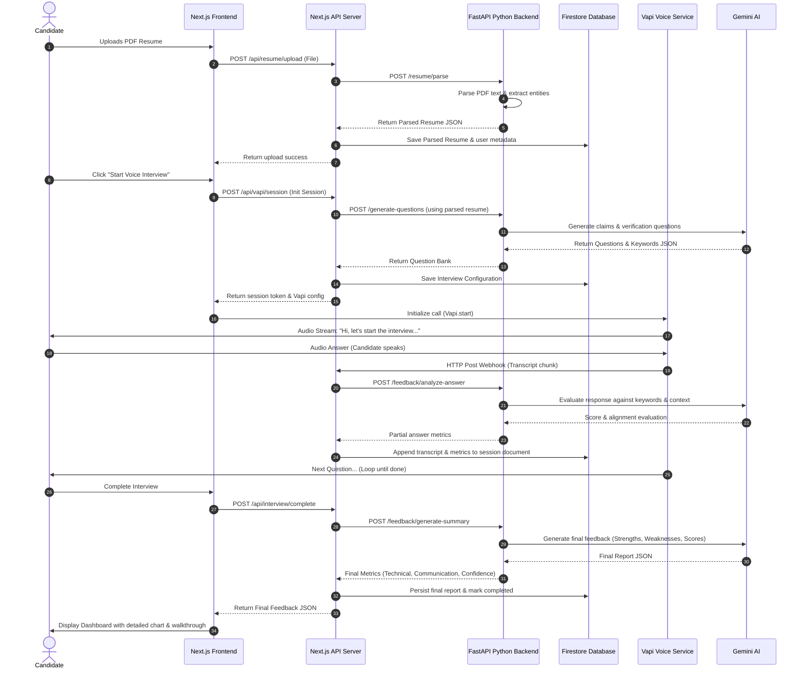
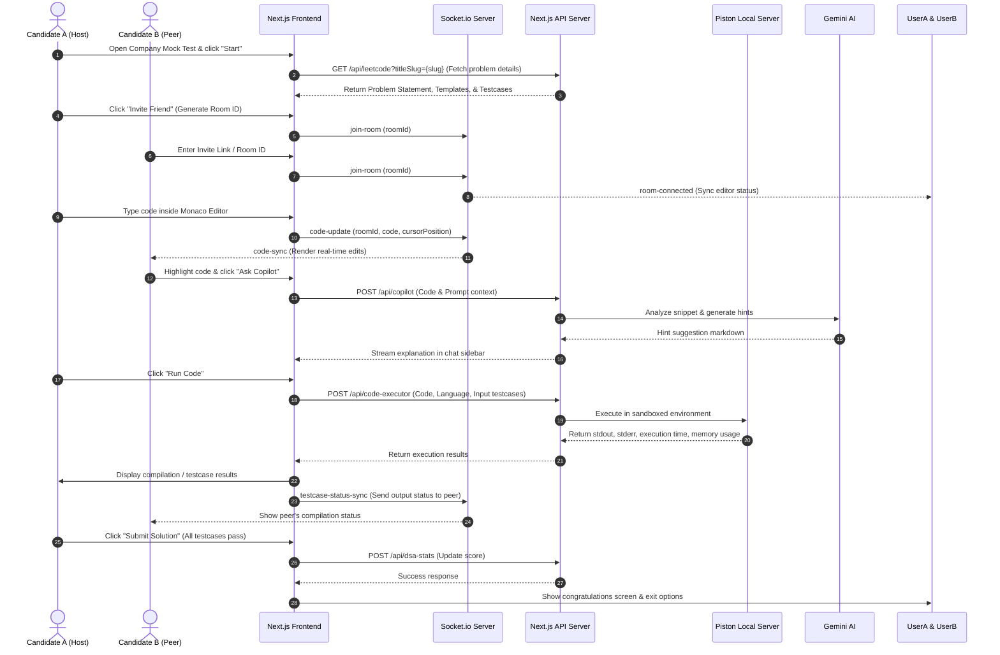
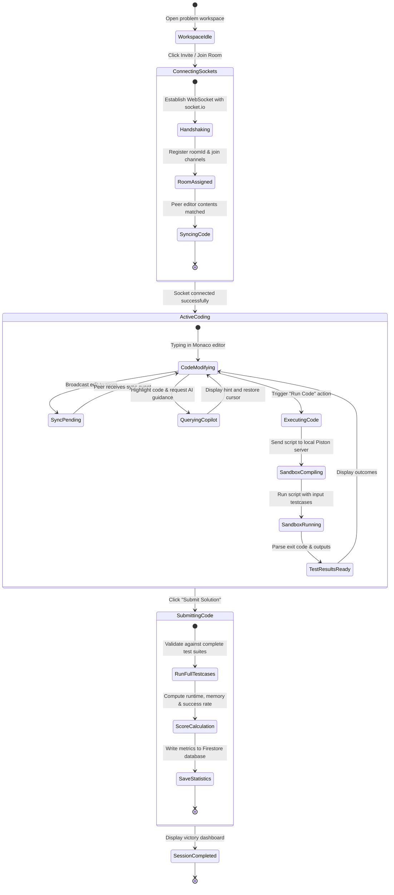

# PrepWise Architecture and System Diagrams

This document contains the system diagrams for the PrepWise AI Interview platform, mapping out the architecture, request lifecycle, and component states.

---

## 1. High-Level Feature Navigation Flowchart

This flowchart illustrates the complete end-to-end path from user arrival and authentication down to every active page, detailing all workflows, features, user actions, and database integrations.

```mermaid
flowchart TD
  %% Entry & Auth
  Start([User Arrival]) --> SignIn[Sign In Page /sign-in]
  Start --> SignUp[Sign Up Page /sign-up]
  SignIn --> ForgotPass[Forgot Password /forgot-password]
  ForgotPass --> VerifyEmail[Verify Action Email /verify-email]
  
  %% Authenticated State
  SignIn -- Success --> Home[Home Page /]
  SignUp -- Success --> Home
  
  %% Home Page Sub-features
  Home --> FeaturedSec[Featured Section]
  Home --> StatsOver[Stats Overview]
  Home --> QuickAccess[Quick Access Panel]
  Home --> ChallengeSec[100 Days to Code Challenge]

  %% Core Features accessed via Quick Access or Sidebar
  QuickAccess & Sidebar[Sidebar Navigation] --> F_Internships[Internships /internships]
  QuickAccess & Sidebar --> F_Jobs[Jobs /jobs]
  QuickAccess & Sidebar --> F_Competitions[Competitions /competitions]
  QuickAccess & Sidebar --> F_MockTests[Mock Tests /mock-test]
  QuickAccess & Sidebar --> F_Resume[Resume Analyzer /resume]
  QuickAccess & Sidebar --> F_Interviews[Mock Interviews /interview]
  QuickAccess & Sidebar --> F_Mentorship[Mentorship /mentorship]
  QuickAccess & Sidebar --> F_100Days[100 Days to Code /100-days-of-code]
  QuickAccess & Sidebar --> F_Courses[Courses /courses]
  QuickAccess & Sidebar --> F_QBank[Question Bank /question-bank]
  QuickAccess & Sidebar --> F_Analytics[Analytics /analytics]
  QuickAccess & Sidebar --> F_Profile[Profile /profile]
  QuickAccess & Sidebar --> F_Settings[Settings /settings]
  QuickAccess & Sidebar --> F_SalaryNeg[Salary Negotiate /salary-negotiation]
  QuickAccess & Sidebar --> F_Upgrade[Upgrade /upgrade]
  
  %% End-to-End Internship Flow
  F_Internships --> SearchFilterIntern[Search & Filter by Location/Type]
  SearchFilterIntern --> ApplyInternModal[Open Application Modal]
  ApplyInternModal --> SubmitInternDetails[Submit Name, Contact & Resume]
  SubmitInternDetails --> SaveInternDb[(Save to Firestore 'applications')]
  SaveInternDb --> ViewMyApps[Track in Dashboard /dashboard/applications]

  %% End-to-End Jobs Flow
  F_Jobs --> FetchJSearch[Fetch Live Jobs from JSearch API / fallback]
  FetchJSearch --> SearchFilterJobs[Filter by Role & Country]
  SearchFilterJobs --> ExternalApply[Redirect to Job Portal / Apply]

  %% End-to-End Competitions Flow
  F_Competitions --> ViewCompetitions[Browse Featured & All Competitions]
  ViewCompetitions --> RegCompetition[Register / View Details]

  %% End-to-End Mock Tests / DSA Flow
  F_MockTests --> CompanySelect[Select Company e.g. Google]
  CompanySelect --> CodeEditor[DSA Practice Workspace]
  CodeEditor --> LoadProblem[Load Problem from Question Bank]
  CodeEditor --> CodeMonaco[Write Code in Monaco Editor]
  CodeMonaco --> PistonLocal[Run Code - Local Piston Sandbox]
  PistonLocal --> OutputConsole[Show Console Logs & Run Status]
  CodeEditor --> CopilotAI[AI Copilot Assistance & Chat]
  CodeEditor --> BuddyMode[Collaborate - Live Socket Room]
  BuddyMode --> JoinPeer[Connect with peer via socket.io]
  BuddyMode & OutputConsole --> GenerateDSAReport[Generate & Save Practice Report]

  %% End-to-End Resume Flow
  F_Resume --> PDFUpload[Upload & Parse PDF]
  PDFUpload --> ParseEntities[Extract Skills, Projects & Exp]
  ParseEntities --> ATSCheck[Get ATS Score & Insights]
  ParseEntities --> ClaimQGen[Generate Claim Verification Questions]
  ParseEntities --> OptimizeSuggest[Get AI-suggested Improvements]
  OptimizeSuggest & ATSCheck --> SaveResumeData[(Save Parsed Resume & Score to Firestore)]

  %% End-to-End Mock Interviews Flow
  F_Interviews --> InterSetup[Setup Role, Domain & Experience]
  InterSetup --> VoiceAgent[Vapi Voice AI Session]
  VoiceAgent --> Proctoring[AICheatDetector & Proctoring Monitor]
  Proctoring --> AlertCheating[Track Tab Swapping & Camera]
  VoiceAgent --> VoiceFeedback[Detailed AI Feedback & Report]
  VoiceFeedback --> SaveInterviewSession[(Save Transcript & Scores to Firestore)]
  SaveInterviewSession --> ViewSessions[View in /dashboard/sessions]

  %% End-to-End Mentorship Flow
  F_Mentorship --> BrowseMentors[Browse Industry Mentors]
  BrowseMentors --> BookSession[Connect & Book Session]

  %% End-to-End 100 Days Flow
  F_100Days --> DaySelect[Select Current Day Challenge]
  DaySelect --> SolProblem[Solve Daily Problem in Workspace]
  SolProblem -- Success --> MarkComplete[Mark Day Completed & Update Timeline]

  %% End-to-End Courses Flow
  F_Courses --> BrowseCatalog[Browse Available Courses]
  BrowseCatalog --> EnrollCourse[Enroll & Track Progress]
  EnrollCourse --> SaveEnrollDb[(Store Enrollment in Firestore)]
  SaveEnrollDb --> ViewMyCourses[Track in Dashboard /dashboard/courses]

  %% End-to-End Question Bank Flow
  F_QBank --> SearchQuestions[Browse and Filter Questions]
  SearchQuestions --> BookmarkQs[Bookmark Questions]
  BookmarkQs --> ViewBookmarked[View in Dashboard /dashboard/bookmarked]

  %% End-to-End Analytics Flow
  F_Analytics --> LoadUserStats[Fetch Session history & Practice metrics]
  LoadUserStats --> RenderCharts[Render Recharts Technical & Comm progression]

  %% End-to-End Profile Flow
  F_Profile --> LoadProfileDetails[Fetch User Details & History]
  LoadProfileDetails --> RenderProfile[Show activity timeline & certificates]

  %% End-to-End Settings Flow
  F_Settings --> UpdateProfileDetails[Update Name / Details]
  F_Settings --> EmailManage[Change Email & Verify]
  EmailManage --> TriggerVerification[Send Firebase verification code]
  TriggerVerification --> ApplyVerificationCode[Apply oobCode via /verify-email]
  ApplyVerificationCode --> SyncFirestoreEmail[(Update Email in Firestore database)]

  %% End-to-End Salary Negotiation Flow
  F_SalaryNeg --> SetupNegotiation[Input Target Role, Comp & Experience]
  SetupNegotiation --> StartNegChat[Start Chat Interface]
  StartNegChat --> AIChatBuddy[Role-play with AI Hiring Manager]
  AIChatBuddy --> EndNegotiation[End Conversation]
  EndNegotiation --> EvaluateNegotiation[Get Strengths, Weaknesses & Score Report]

  %% End-to-End Upgrade Flow
  F_Upgrade --> SelectPlan[Select Pro/Premium Plan]
  SelectPlan --> Checkout[Initiate Checkout / Stripe Payment]

  %% Dashboards Integration
  Home & Sidebar --> Dashboards[Your Dashboards]
  Dashboards --> D_Activity[My Activity /dashboard/activity]
  Dashboards --> D_Applications[My Applications /dashboard/applications]
  Dashboards --> D_Rounds[My Rounds /dashboard/rounds]
  Dashboards --> D_Courses[My Courses /dashboard/courses]
  Dashboards --> D_Sessions[My Sessions /dashboard/sessions]
  Dashboards --> D_Certificates[My Certificates /dashboard/certificates]
  Dashboards --> D_Recent[Recently Viewed /dashboard/recent]
  Dashboards --> D_Watchlist[Watchlist /dashboard/watchlist]
  Dashboards --> D_Bookmarked[Bookmarked Qs /dashboard/bookmarked]
  Dashboards --> D_SavedIntern[Saved Internships /saved-internships]
```

---

## 2. Core Request Lifecycles (Sequence Diagrams)

### Flow A: AI Voice Interview Request Lifecycle

This sequence diagram details the step-by-step data lifecycle of the primary user workflow: uploading a resume, generating custom questions, conducting a voice-based mock interview via Vapi, and receiving AI feedback.

### Flow B: DSA Practice Room & Socket Collaboration Lifecycle

This sequence diagram details the data and network lifecycle for a coding session, showing the integration of Monaco editor, local Piston sandbox execution, live web socket syncing (Buddy Mode), and AI Copilot assistance.

---

## 3. Component & State Lifecycle Diagrams (State Diagrams)

### State Diagram A: AI Voice Interview Session Machine

This state diagram models the internal transition phases of the AI Interview voice engine—capturing the initial configuration, live voice streaming loop, cheating checks, score calculations, and feedback generation.

```mermaid
stateDiagram-v2
    [*] --> Idle: User enters setup page
    Idle --> LoadingConfig: User uploads resume & configures persona
    
    state LoadingConfig {
        [*] --> ParsingResume: Extract resume text
        ParsingResume --> GeneratingQuestions: FastAPI generates question bank
        GeneratingQuestions --> SavingSession: Store configuration in Firestore
        SavingSession --> [*]
    }
    
    LoadingConfig --> VoiceSessionInit: Frontend establishes Vapi connection
    
    state VoiceSessionInit {
        [*] --> Handshake: Next.js exchanges Web Token
        Handshake --> SystemPromptInjected: Custom system prompt loaded
        SystemPromptInjected --> [*]
    }
    
    VoiceSessionInit --> InterviewInProgress: Audio streaming active
    
    state InterviewInProgress {
        [*] --> AgentSpeaking: Vapi speaks question
        AgentSpeaking --> CandidateAnswering: Candidate speaks answer
        CandidateAnswering --> TranscriptGeneration: Vapi STT converts voice to text
        TranscriptGeneration --> RealtimeEvaluation: Next.js evaluates response
        RealtimeEvaluation --> CheckCheating: Proctoring API scans logs
        CheckCheating --> AgentSpeaking: Loop (Next question)
        CheckCheating --> FinalizeSession: No more questions
    }
    
    InterviewInProgress --> AnalyzingFeedback: Interview ended
    
    state AnalyzingFeedback {
        [*] --> ComputeScores: Math weights for Technical & Confidence
        ComputeScores --> QueryLLM: Call Gemini for qualitative feedback
        QueryLLM --> UpdateDB: Persist final JSON in Firestore
        UpdateDB --> [*]
    }
    
    AnalyzingFeedback --> Completed: Display Dashboard UI
    Completed --> [*]
```

### State Diagram B: DSA Collaborative Practice Room Machine

This state diagram models the state machine for the collaborative coding workspace, covering editor synchronizations, local Piston code compilation phases, AI Copilot consulting, and final metrics submission.

