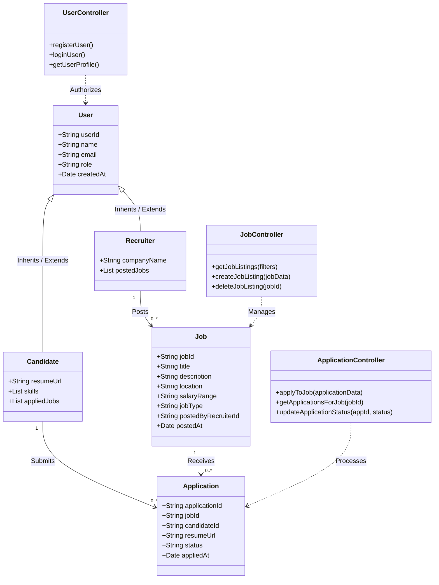

# Internship & Job Feature Architecture

Here is the architectural overview of the Job & Internship Portal feature, representing the end-to-end flow from searching to applying.

---

## 1. Sequence Diagram: Job Search & Application Flow

This diagram illustrates how a Candidate searches for a job and submits an application, showing the interaction between Frontend, Backend API Layer, Firestore Database, and external Third-Party APIs.

```mermaid
sequenceDiagram
    autonumber
    actor Candidate as Candidate/User
    participant FE as Frontend UI (React/Next.js)
    participant BE as Backend Server (API Gateway)
    participant DB as Firestore / Local DB
    participant ExtAPI as Third-Party Job Aggregators

    %% Searching Flow
    Candidate->>FE: Enter Search Query (Filters: Location, Type)
    FE->>BE: GET /api/jobs?keyword=react&location=remote
    
    rect rgb(30, 41, 59)
        note right of BE: Hybrid Fetch Logic
        BE->>DB: Query Local Posted Jobs
        DB-->>BE: Return Local Jobs List
        BE->>ExtAPI: Fetch Job aggregations (e.g., Adzuna/JSearch)
        ExtAPI-->>BE: Return External Jobs List
    end

    BE-->>FE: Consolidated & Paginated Job Results JSON
    FE-->>Candidate: Display Jobs List with Search Filters

    %% Applying Flow
    Candidate->>FE: Click 'Apply' & Upload Resume
    FE->>BE: POST /api/applications (Payload: jobID, resumeURL, userID)
    
    rect rgb(30, 41, 59)
        note right of BE: Authorization Check
        BE->>DB: Validate userRole is 'candidate'
        DB-->>BE: User Role Validated
    end

    BE->>DB: Save Application record in 'applications' collection
    DB-->>BE: Write Success
    BE-->>FE: Return HTTP 201 Created (Application Successful)
    FE-->>Candidate: Show success toast notification
```

---

## 2. Class Diagram: Data Models & Controllers

This class diagram represents the structure of the entities (Job, Candidate, Recruiter, Application) and how they relate to the Controllers/Services at the code level.

