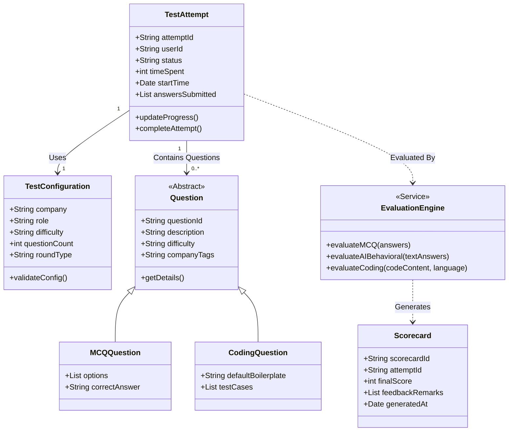

# PrepWise Mock Test Architecture

Here is the detailed architectural overview of the **PrepWise Mock Test Portal**, covering configuration, test execution, and grading for Technical, Behavioral, System Design, and Coding Rounds.

---

## 1. Sequence Diagram: Test Execution & Dynamic Evaluation Flow

This diagram shows how a user configures a mock test, interacts with different round types, and gets real-time grading.

```mermaid
sequenceDiagram
    autonumber
    actor User as Candidate
    participant FE as Frontend Dashboard (React)
    participant BE as Backend Controller (Express/Next.js)
    participant DB as Firestore Database
    participant EvalEngine as Grading & AI Evaluation Engine
    participant Comp as Code Compiler API (Judge0/Piston)

    %% Configuration & Initialization
    User->>FE: Select Round Type (Technical / Behavioral / System Design / Coding)
    User->>FE: Set Configuration (Company, Difficulty, Question Count)
    FE->>BE: GET /api/tests/questions?type=coding&company=Google&difficulty=medium
    BE->>DB: Query questions matching criteria
    DB-->>BE: Returns Question Dataset
    BE-->>FE: Populate Test Dashboard & Start Client-Side Timer

    %% Test Taking and Auto-Save Loop
    loop Every Answer Input
        User->>FE: Answer MCQ / Write Code / Enter Text
        FE->>BE: POST /api/tests/auto-save (Session State Persistence)
        BE->>DB: Update 'testAttempt' collection status
    end

    %% Test Submission & Round-Wise Evaluation
    User->>FE: Click 'Submit Test' (or Timer Expires)
    FE->>BE: POST /api/tests/submit (Payload: answers, attemptId)
    
    rect rgb(30, 41, 59)
        note right of BE: Branching Evaluation Logic by Round Type
        alt Technical/MCQ Round
            BE->>EvalEngine: Check MCQ responses against Answer Keys
            EvalEngine-->>BE: Return Score
        else Behavioral & System Design Round
            BE->>EvalEngine: Pass Text Answers to AI Scorer (LLM / API)
            EvalEngine->>EvalEngine: Analyze sentiment & architectural keys
            EvalEngine-->>BE: Return Feedback & Marks
        else Coding Challenge Round
            BE->>Comp: Pass Code Payload with dynamic Test Cases
            Comp-->>BE: Return Compile State & Passed Cases count
        end
    end

    BE->>DB: Save Final Scorecard & Update Session status to 'completed'
    DB-->>BE: Write Success
    BE-->>FE: Return Complete Performance JSON (Scores, Tips)
    FE-->>User: Display Comprehensive Scorecard & Feedback Chart
```

---

## 2. Class Diagram: Mock Test Objects & Evaluation Engines

This class diagram represents the OOP design of the Mock Test system.

