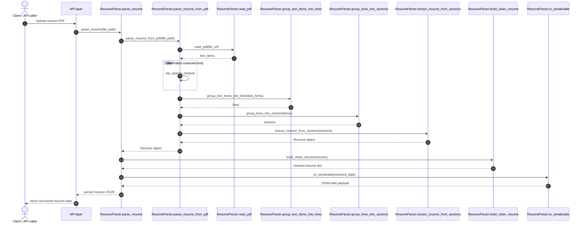

# ResumeParser Sequence Diagram

This diagram reflects the parsing flow implemented in [ResumeInterview/ResumeParser/parser.py](../ResumeInterview/ResumeParser/parser.py).

```mermaid
sequenceDiagram
    autonumber
    actor User as Client / API caller
    participant API as API layer
    participant Parser as ResumeParser.parse_resume
    participant PDFParser as ResumeParser.parse_resume_from_pdf
    participant Reader as ResumeParser.read_pdf
    participant LineBuilder as ResumeParser.group_text_items_into_lines
    participant SectionBuilder as ResumeParser.group_lines_into_sections
    participant Extractor as ResumeParser.extract_resume_from_sections
    participant Cleaner as ResumeParser.build_clean_resume
    participant Serializer as ResumeParser.to_serializable

    User->>API: Upload resume PDF
    API->>Parser: parse_resume(file_path)
    Parser->>PDFParser: parse_resume_from_pdf(file_path)
    PDFParser->>Reader: read_pdf(file_url)
    Reader-->>PDFParser: text_items

    loop Normalize extracted text
        PDFParser->>PDFParser: nlp_spacing_fix(text)
    end

    PDFParser->>LineBuilder: group_text_items_into_lines(text_items)
    LineBuilder-->>PDFParser: lines
    PDFParser->>SectionBuilder: group_lines_into_sections(lines)
    SectionBuilder-->>PDFParser: sections
    PDFParser->>Extractor: extract_resume_from_sections(sections)
    Extractor-->>PDFParser: Resume object
    PDFParser-->>Parser: Resume object

    Parser->>Cleaner: build_clean_resume(resume)
    Cleaner-->>Parser: cleaned resume dict
    Parser->>Serializer: to_serializable(cleaned_data)
    Serializer-->>Parser: JSON-safe payload
    Parser-->>API: parsed resume JSON
    API-->>User: return structured resume data
```
