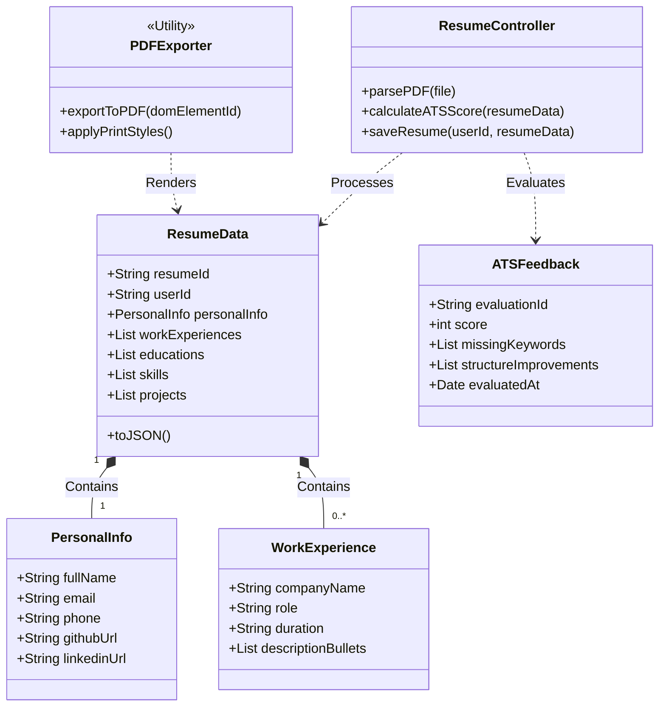

# PrepWise Resume Feature Architecture

Here is the detailed architectural overview of the **PrepWise Resume Builder & AI Review System**, covering form integration, AI parsing (LLM based), ATS Scoring, and dynamic CSS PDF export.

---

## 1. Sequence Diagram: Upload, Parse, ATS Evaluation & Export Flow

This diagram traces how a user uploads a resume, how the AI reviews it for ATS optimization, and how the printable PDF is generated.

```mermaid
sequenceDiagram
    autonumber
    actor User as Candidate
    participant FE as Frontend UI (React)
    participant BE as Backend API Gateway
    participant AI as AI Engine (LLM Parser)
    participant DB as Firestore Database

    %% Flow A: Upload & Parsing
    User->>FE: Upload existing Resume (.pdf)
    FE->>BE: POST /api/resume/parse (multipart/form-data)
    
    rect rgb(30, 41, 59)
        note right of BE: Parse & Structure Logic
        BE->>BE: Extract text from PDF bytes
        BE->>AI: Send extracted text + prompt to return JSON schema
        AI-->>BE: Returns Structured JSON (Experience, Skills, Education)
    end

    BE-->>FE: Return JSON structure
    FE-->>User: Auto-populate details in Resume Builder Form

    %% Flow B: ATS scoring and analysis
    User->>FE: Click 'Check ATS Score'
    FE->>BE: POST /api/resume/score (Payload: Resume JSON)
    BE->>AI: Evaluate ATS compatibility & missing keywords
    AI-->>BE: Returns ATS Score (0-100) & Improvements list
    BE->>DB: Save resume evaluation record
    BE-->>FE: Return Scorecard & Feedback JSON
    FE-->>User: Show ATS meter & critical fix recommendations

    %% Flow C: PDF Export
    User->>FE: Select Template & Click 'Download PDF'
    FE->>FE: Trigger Window Print/html2pdf canvas scaling
    FE->>FE: Apply CSS @media print layout transformations
    FE-->>User: Download pixel-perfect A4 PDF Document
```

---

## 2. Class Diagram: Resume Domain Objects

This class diagram represents the structure of Resume components, parsing controllers, and export format controllers.

