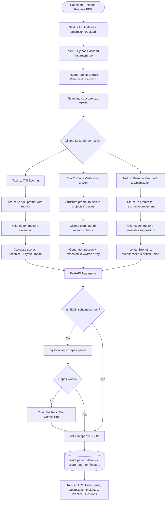
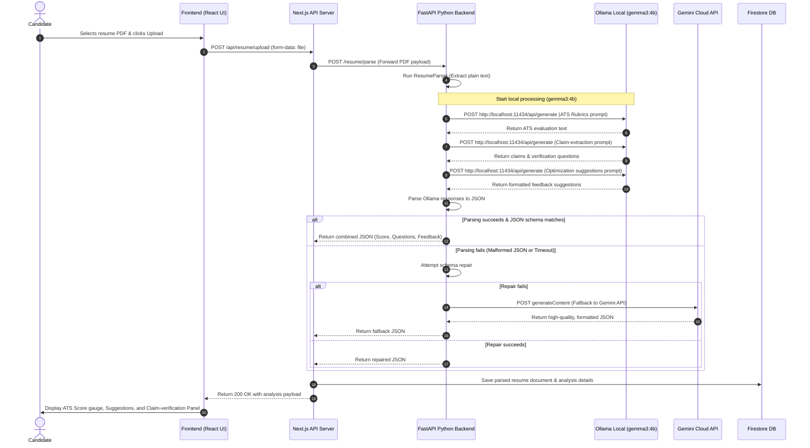
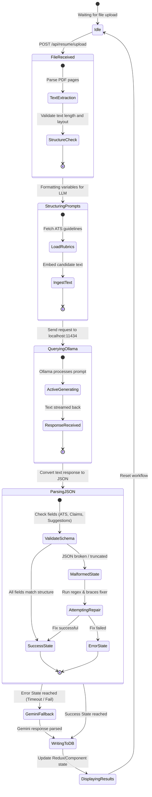

# PrepWise AI Resume & Ollama Integration Diagrams

This document contains specialized diagrams mapping out the Ollama-powered AI Resume pipeline, including PDF Parsing, ATS Score calculation, Feedback Generation, and Claim-Verification Question Generation.

---

## 1. AI Resume Pipeline Flowchart

This flowchart details the complete step-by-step document analysis, entity extraction, and evaluation pipeline using local Python microservices and the Ollama (`gemma3:4b`) instance.

---

## 2. Request Lifecycle (Sequence Diagram with Fallbacks)

This sequence diagram outlines the detailed network messages exchanged between the Next.js frontend, Next.js API server, FastAPI backend, local Ollama server, Gemini Cloud API (as fallback), and Firestore.

---

## 3. Ollama Evaluation Engine State Machine (State Diagram)

This state diagram illustrates the internal lifecycle of the parsing and LLM evaluation engine during resume processing, highlighting input verification, active generation, retry logic, and fallback branches.

