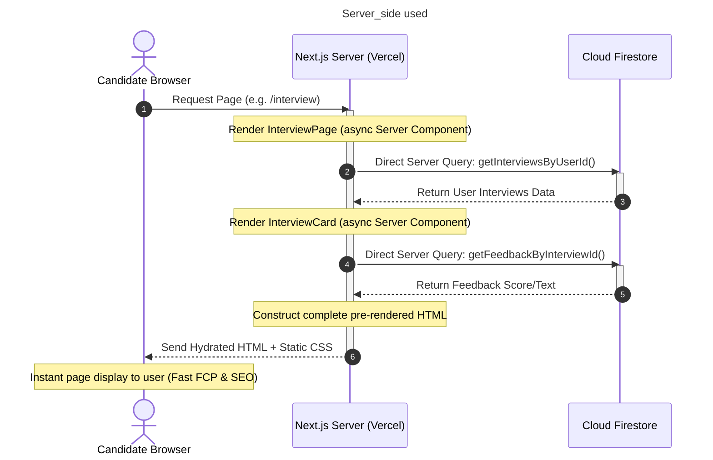

# PrepWise Server-Side Rendering (SSR) & Server Components Guide

This document details where and how Server-Side Rendering (SSR) and React Server Components (RSC) are implemented within the PrepWise Next.js architecture.

---

## 🗺️ Server-Side Rendering Pipeline (Mermaid)



---

## ⚙️ SSR Implementations in the Project

### 1. Dynamic Server-Side Pages
* **File:** [app/(root)/interview/page.jsx](file:///d:/Projects/AI_interview/app/\(root\)/interview/page.jsx)
* **How it works:** 
  The entire function `InterviewPage()` is declared as `async`. Before the page HTML is compiled, Next.js calls Firestore actions synchronously:
  ```javascript
  const user = await getCurrentUser();
  const [userInterviews, allInterviews] = await Promise.all([
    getInterviewsByUserId(user?.id),
    getLatestInterviews({ userId: user?.id }),
  ]);
  ```
  This data is injected directly into the HTML markup on the server.

### 2. Async Server Components
* **File:** [components/InterviewCard.jsx](file:///d:/Projects/AI_interview/components/InterviewCard.jsx)
* **How it works:**
  Only Server Components can be `async` functions that execute database queries directly within the component execution flow:
  ```javascript
  const InterviewCard = async ({ interviewId, userId, ... }) => {
    const feedback = userId && interviewId 
      ? await getFeedbackByInterviewId({ interviewId, userId }) 
      : null;
    ...
  }
  ```
  The browser receives the final populated card markup without needing client-side `useEffect` or loading spinners.

### 3. Server Actions ("use server")
* **File:** [lib/actions/general.action.js](file:///d:/Projects/AI_interview/lib/actions/general.action.js) & [lib/actions/auth.action.js](file:///d:/Projects/AI_interview/lib/actions/auth.action.js)
* **How it works:**
  Marked with the `"use server"` directive at the top, these functions run entirely on the server. When client-side components (like the "Finish Interview" buttons) call these functions, they send encrypted requests to the server, protecting database credentials.

---

## ⚖️ Server Components vs. Client Components

| Feature | Server Components (SSR) | Client Components (`"use client"`) |
| :--- | :--- | :--- |
| **Execution** | Runs only on the server. | Runs on server (pre-render) and hydrates on client. |
| **Direct DB Access** | Yes (can query Firestore directly). | No (must request via APIs or Server Actions). |
| **React Hooks** | No (`useState`, `useEffect` not supported). | Yes (full access to interactive hooks). |
| **SEO & Performance**| High (sends ready HTML directly). | Standard (requires client JavaScript load). |
| **Examples in Code** | `InterviewPage`, `InterviewCard`, Layouts. | `InterviewRunner`, `ThemeToggle`, `Agent` (voice/video UI). |
